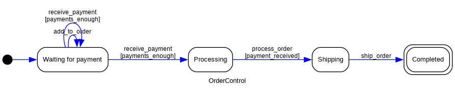
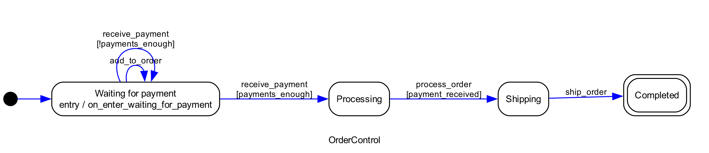
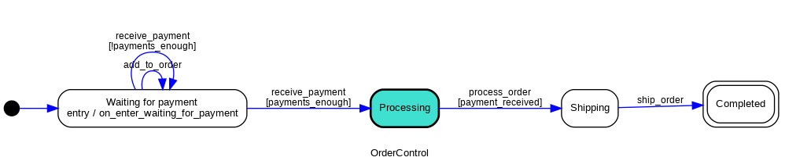
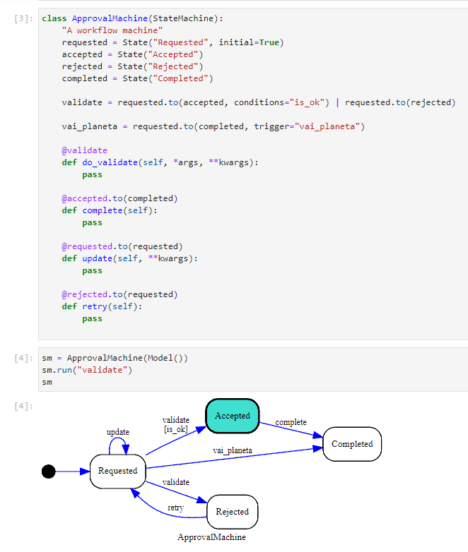
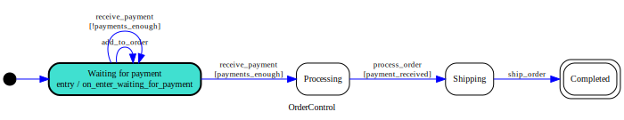

# Diagrams

You can generate diagrams from your {ref}`StateMachine`.

```{note}
This functionality depends on [pydot](https://github.com/pydot/pydot), it means that you need to
have `pydot` installed on your system. pydot is a Python library that allows you to create and
manipulate graphs in [Graphviz](https://graphviz.org/)'s
[dot language](https://graphviz.org/doc/info/lang.html).

In order to use [pydot](https://github.com/pydot/pydot), we also need to have
[Graphviz](https://graphviz.org/) installed on your system.

You can install this library already with pydot dependency using the `extras` install option:

    pip install python-statemachine[diagrams]


Or to install `pydot` manually, you can use pip by running the following command:

    pip install pydot


To install Graphviz, you can visit the [Graphviz website](https://graphviz.org/) and follow the
instructions for your operating system. Alternatively, you can use a package manager to install
Graphviz. For example, on Debian-based systems (such as Ubuntu), you can use the following command:

    sudo apt install graphviz

```

## How to generate a diagram at runtime


```py
>>> from statemachine.contrib.diagram import DotGraphMachine

>>> from tests.examples.order_control_machine import OrderControl

>>> graph = DotGraphMachine(OrderControl)  # also accepts instances

>>> dot = graph()

>>> dot.to_string()  # doctest: +ELLIPSIS
'digraph list {...

```

With a `dot` graph instance, you can also generate images:

```py
>>> dot.write_png("docs/images/order_control_machine_initial.png")

```

As this one:





If you find the resolution of the image lacking, you can

```py
>>> dot.set_dpi(300)

>>> dot.write_png("docs/images/order_control_machine_initial_300dpi.png")

```




The current {ref}`state` is also highlighted:

``` py
>>> # This example will only run on automated tests if dot is present
>>> getfixture("requires_dot_installed")

>>> from statemachine.contrib.diagram import DotGraphMachine

>>> from tests.examples.order_control_machine import OrderControl

>>> machine = OrderControl()

>>> graph = DotGraphMachine(machine)  # also accepts instances

>>> machine.receive_payment(10)
[10]

>>> graph().write_png("docs/images/order_control_machine_processing.png")

```




```{hint}

A handy shortcut to have the graph representation:

```py
>>> machine._graph()
<pydot.core.Dot ...

```

## Generate from the command line

You can also generate a diagram from the command line using the `statemachine.contrib.diagram` as a module.

```bash
❯ python -m statemachine.contrib.diagram --help
usage: diagram.py [OPTION] <classpath> <out>

Generate diagrams for StateMachine classes.

positional arguments:
  classpath   A fully-qualified dotted path to the StateMachine class.
  out         File to generate the image using extension as the output format.

optional arguments:
  -h, --help  show this help message and exit
```

Example:

```bash
python -m statemachine.contrib.diagram tests.examples.traffic_light_machine.TrafficLightMachine m.png
```

```{note}
Supported formats include: `dia`, `dot`, `fig`, `gif`, `jpg`, `pdf`, `png`, `ps`, `svg` and many others.
Please see [pydot](https://github.com/pydot/pydot) and [Graphviz](https://graphviz.org/) for a
complete list.
```


## JupyterLab / Jupyter integration

Machines instances are automatically displayed as a diagram when used on JupyterLab cells:





## Don't want to install Graphviz


```{eval-rst}
.. autofunction:: statemachine.contrib.diagram.quickchart_write_svg
```


