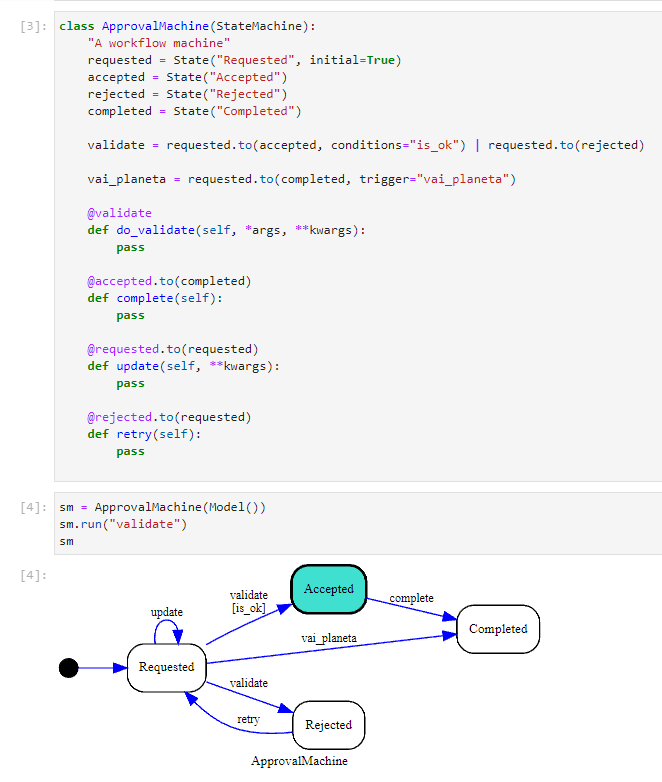

(diagram)=
(diagrams)=
# Diagrams

You can generate visual diagrams from any
{class}`~statemachine.statemachine.StateChart` — useful for documentation,
debugging, or sharing your machine's structure with teammates.

```{statemachine-diagram} tests.examples.order_control_machine.OrderControl
:target:
```

## Installation

Diagram generation requires [pydot](https://github.com/pydot/pydot) and
[Graphviz](https://graphviz.org/):

```bash
pip install python-statemachine[diagrams]  # installs pydot
```

You also need the `dot` command-line tool from Graphviz. On Debian/Ubuntu:

```bash
sudo apt install graphviz
```

For other systems, see the [Graphviz downloads page](https://graphviz.org/download/).

## Generating diagrams

Every state machine instance exposes a `_graph()` method that returns a
[pydot.Dot](https://github.com/pydot/pydot) graph object:

```python
from tests.examples.order_control_machine import OrderControl

sm = OrderControl()
graph = sm._graph()  # returns a pydot.Dot object
```

### Highlighting the current state

The diagram automatically highlights the current state of the instance.
Send events to advance the machine and see the active state change:

```python
from tests.examples.traffic_light_machine import TrafficLightMachine

sm = TrafficLightMachine()
sm.send("cycle")
sm._graph().write_png("traffic_light_yellow.png")
```

```{statemachine-diagram} tests.examples.traffic_light_machine.TrafficLightMachine
:events: cycle
:caption: TrafficLightMachine after one cycle
```


### Exporting to a file

The `pydot.Dot` object supports writing to many formats — use
`write_png()`, `write_svg()`, `write_pdf()`, etc.:

```python
sm = OrderControl()
sm._graph().write_png("order_control.png")
```

```{statemachine-diagram} tests.examples.order_control_machine.OrderControl
:caption: OrderControl
```

For higher resolution PNGs, set the DPI before exporting:

```python
graph = sm._graph()
graph.set_dpi(300).write_png("order_control_300dpi.png")
```

```{note}
Supported formats include `dia`, `dot`, `fig`, `gif`, `jpg`, `pdf`,
`png`, `ps`, `svg`, and many others. See
[Graphviz output formats](https://graphviz.org/docs/outputs/) for the
complete list.
```


## Text representations

State machines support multiple text-based output formats, all accessible
through Python's built-in `format()` protocol, the `formatter` API, or
the command line.

| Format | Aliases | Description | Dependencies |
|--------|---------|-------------|--------------|
| `mermaid` | | [Mermaid stateDiagram-v2](https://mermaid.js.org/syntax/stateDiagram.html) source | None [^mermaid] |
| `md` | `markdown` | Transition table (pipe-delimited Markdown) | None |
| `rst` | | Transition table (RST grid table) | None |
| `dot` | | [Graphviz DOT](https://graphviz.org/doc/info/lang.html) language source | pydot |
| `svg` | | SVG markup (generated via DOT) | pydot, Graphviz |

[^mermaid]: Mermaid has a known rendering bug
    ([mermaid-js/mermaid#4052](https://github.com/mermaid-js/mermaid/issues/4052))
    where transitions targeting or originating from a compound state inside a
    parallel region crash the renderer.  As a workaround, the `MermaidRenderer`
    redirects such transitions to the compound's initial child state.  The
    visual result is equivalent — Mermaid draws the arrow crossing into the
    compound boundary — but the arrow points to the child rather than the
    compound border.  This workaround will be revisited when the upstream bug
    is resolved.


### Using `format()`

Use f-strings or the built-in `format()` function — no diagram imports needed:

```py
>>> from tests.examples.traffic_light_machine import TrafficLightMachine
>>> sm = TrafficLightMachine()
>>> print(f"{sm:mermaid}")
stateDiagram-v2
    direction LR
    state "Green" as green
    state "Yellow" as yellow
    state "Red" as red
    [*] --> green
    green --> yellow : Cycle
    yellow --> red : Cycle
    red --> green : Cycle
<BLANKLINE>
    classDef active fill:#40E0D0,stroke:#333
    green:::active
<BLANKLINE>

>>> print(f"{sm:md}")
| State  | Event | Guard | Target |
| ------ | ----- | ----- | ------ |
| Green  | Cycle |       | Yellow |
| Yellow | Cycle |       | Red    |
| Red    | Cycle |       | Green  |
<BLANKLINE>

```

Works on **classes** too (no active-state highlighting):

```py
>>> print(f"{TrafficLightMachine:mermaid}")
stateDiagram-v2
    direction LR
    state "Green" as green
    state "Yellow" as yellow
    state "Red" as red
    [*] --> green
    green --> yellow : Cycle
    yellow --> red : Cycle
    red --> green : Cycle
<BLANKLINE>

```

The `dot` format returns the Graphviz DOT language source:

```py
>>> print(f"{sm:dot}")  # doctest: +ELLIPSIS
digraph TrafficLightMachine {
...
}

```

An empty format spec (e.g., `f"{sm:}"`) falls back to `repr()`.


(formatter-api)=
### Using the `formatter` API

The `formatter` object is the programmatic entry point for rendering
state machines in any registered text format:

```py
>>> from statemachine.contrib.diagram import formatter
>>> from tests.examples.traffic_light_machine import TrafficLightMachine

>>> print(formatter.render(TrafficLightMachine, "mermaid"))
stateDiagram-v2
    direction LR
    state "Green" as green
    state "Yellow" as yellow
    state "Red" as red
    [*] --> green
    green --> yellow : Cycle
    yellow --> red : Cycle
    red --> green : Cycle
<BLANKLINE>

>>> formatter.supported_formats()
['dot', 'markdown', 'md', 'mermaid', 'rst', 'svg']

```

Both `format()` and the Sphinx directive delegate to this same `formatter`
under the hood.


#### Registering custom formats

The `formatter` is extensible — register your own format with a
decorator and it becomes available everywhere (`format()`, CLI,
Sphinx directive):

```python
from statemachine.contrib.diagram import formatter

@formatter.register_format("plantuml", "puml")
def _render_plantuml(machine_or_class):
    # your PlantUML renderer here
    ...
```

After registration, `f"{sm:plantuml}"` and `--format plantuml` work
immediately.


### Command line

You can generate diagrams without writing Python code:

```bash
python -m statemachine.contrib.diagram <classpath> <output_file>
```

The output format is inferred from the file extension:

```bash
python -m statemachine.contrib.diagram tests.examples.traffic_light_machine.TrafficLightMachine diagram.png
```

To highlight the current state, use `--events` to instantiate the machine and
send events before rendering:

```bash
python -m statemachine.contrib.diagram tests.examples.traffic_light_machine.TrafficLightMachine diagram.png --events cycle cycle cycle
```

Use `--format` to produce a text format instead of a Graphviz image:

```bash
# Mermaid stateDiagram-v2
python -m statemachine.contrib.diagram tests.examples.traffic_light_machine.TrafficLightMachine output.mmd --format mermaid

# DOT source
python -m statemachine.contrib.diagram tests.examples.traffic_light_machine.TrafficLightMachine output.dot --format dot

# Markdown transition table
python -m statemachine.contrib.diagram tests.examples.traffic_light_machine.TrafficLightMachine output.md --format md

# RST transition table
python -m statemachine.contrib.diagram tests.examples.traffic_light_machine.TrafficLightMachine output.rst --format rst
```

Use `-` as the output file to write to stdout (handy for piping):

```bash
python -m statemachine.contrib.diagram tests.examples.traffic_light_machine.TrafficLightMachine - --format mermaid
```


## Auto-expanding docstrings

Use `{statechart:FORMAT}` placeholders in your class docstring to embed
a live representation of the state machine. The placeholder is replaced
at class definition time, so the docstring always reflects the actual
states and transitions:

```py
>>> from statemachine.statemachine import StateChart
>>> from statemachine.state import State

>>> class TrafficLight(StateChart):
...     """A traffic light.
...
...     {statechart:md}
...     """
...     green = State(initial=True)
...     yellow = State()
...     red = State()
...     cycle = green.to(yellow) | yellow.to(red) | red.to(green)

>>> print(TrafficLight.__doc__)
A traffic light.
<BLANKLINE>
| State  | Event | Guard | Target |
| ------ | ----- | ----- | ------ |
| Green  | Cycle |       | Yellow |
| Yellow | Cycle |       | Red    |
| Red    | Cycle |       | Green  |
<BLANKLINE>
<BLANKLINE>

```

Any registered format works: `{statechart:rst}`, `{statechart:mermaid}`,
`{statechart:dot}`, etc.

### Choosing the right format

| Context | Recommended format |
|---------|-------------------|
| Sphinx with RST (autodoc default) | `{statechart:rst}` |
| Sphinx with MyST Markdown | `{statechart:md}` |
| `help()` in terminal / IDE | Either works; `md` reads more cleanly |

### Sphinx autodoc integration

Since the placeholder is expanded at class definition time, Sphinx `autodoc`
sees the final rendered text — no extra configuration needed.

For example, this class uses `{statechart:rst}` in its docstring:

```{literalinclude} ../tests/machines/showcase_simple.py
:pyobject: SimpleSC
:language: python
```

And here is the rendered autodoc output:

```{eval-rst}
.. autoclass:: tests.machines.showcase_simple.SimpleSC
   :noindex:
```


## Sphinx directive

If you use [Sphinx](https://www.sphinx-doc.org/) to build your documentation, the
`statemachine-diagram` directive renders diagrams inline — no need to generate
image files manually.

### Setup

Add the extension to your `conf.py`:

```python
extensions = [
    ...
    "statemachine.contrib.diagram.sphinx_ext",
]
```

### Basic usage

Reference any importable {class}`~statemachine.statemachine.StateChart` class by
its fully qualified path:

````markdown
```{statemachine-diagram} myproject.machines.OrderControl
```
````

```{statemachine-diagram} tests.examples.order_control_machine.OrderControl
:alt: OrderControl state machine
:align: center
```

### Highlighting a specific state

Pass `:events:` to instantiate the machine and send events before rendering.
This highlights the current state after processing:

````markdown
```{statemachine-diagram} myproject.machines.TrafficLight
:events: cycle
:caption: Traffic light after one cycle
```
````

```{statemachine-diagram} tests.examples.traffic_light_machine.TrafficLightMachine
:events: cycle
:caption: Traffic light after one cycle
:align: center
```

### Enabling zoom

For complex diagrams, add `:target:` (without a value) to make the diagram
clickable — it opens the full SVG in a new browser tab where users can
zoom and pan freely:

````markdown
```{statemachine-diagram} myproject.machines.OrderControl
:target:
```
````

```{statemachine-diagram} tests.examples.order_control_machine.OrderControl
:caption: Click to open full-size SVG
:target:
:align: center
```

### Mermaid format

Use `:format: mermaid` to render via
[sphinxcontrib-mermaid](https://github.com/mgaitan/sphinxcontrib-mermaid)
instead of Graphviz SVG — useful when you don't want to install Graphviz
in your docs build environment:

````markdown
```{statemachine-diagram} myproject.machines.TrafficLight
:format: mermaid
:caption: Rendered as Mermaid
```
````

```{statemachine-diagram} tests.examples.traffic_light_machine.TrafficLightMachine
:format: mermaid
:caption: TrafficLightMachine (Mermaid)
:align: center
```

### Directive options

The directive supports the same layout options as the standard `image` and
`figure` directives, plus state-machine-specific ones.

**State-machine options:**

`:events:` *(comma-separated string)*
: Events to send in sequence. When present, the machine is instantiated and
  each event is sent before rendering.

`:format:` *(string)*
: Output format. Use `mermaid` to render via sphinxcontrib-mermaid
  instead of Graphviz SVG. Default: DOT/SVG.

**Image/figure options:**

`:caption:` *(string)*
: Caption text; wraps the image in a `figure` node.

`:alt:` *(string)*
: Alt text for the image. Defaults to the class name.

`:width:` *(CSS length, e.g. `400px`, `80%`)*
: Explicit width for the diagram.

`:height:` *(CSS length)*
: Explicit height for the diagram.

`:scale:` *(integer percentage, e.g. `50%`)*
: Uniform scaling relative to the intrinsic size.

`:align:` *(left | center | right)*
: Image alignment. Defaults to `center`.

`:target:` *(URL or empty)*
: Makes the diagram clickable. When set without a value, the raw SVG is
  saved as a file and linked so users can open it in a new tab for
  full-resolution zooming — useful for large or complex diagrams.

`:class:` *(space-separated strings)*
: Extra CSS classes for the wrapper element.

`:figclass:` *(space-separated strings)*
: Extra CSS classes for the `figure` element (only when `:caption:` is set).

`:name:` *(string)*
: Reference target name for cross-referencing with `{ref}`.

```{note}
The directive imports the state machine class at Sphinx parse time. Machines
defined inline in doctest blocks cannot be referenced — use the
`_graph()` method for those cases.
```


## Jupyter integration

State machine instances are automatically rendered as diagrams in
JupyterLab cells — no extra code needed:




## Online generation (QuickChart)

If you prefer not to install Graphviz locally, you can generate diagrams
using the [QuickChart](https://quickchart.io/) online service:

```{eval-rst}
.. autofunction:: statemachine.contrib.diagram.quickchart_write_svg
```


## Customizing the output

The `DotGraphMachine` class gives you control over the diagram's visual
properties. Subclass it and override the class attributes to customize
fonts, colors, and layout:

```python
from statemachine.contrib.diagram import DotGraphMachine
from tests.examples.order_control_machine import OrderControl
```

Available attributes:

| Attribute | Default | Description |
|-----------|---------|-------------|
| `graph_rankdir` | `"LR"` | Graph direction (`"LR"` left-to-right, `"TB"` top-to-bottom) |
| `font_name` | `"Helvetica"` | Font face for labels |
| `state_font_size` | `"10"` | State label font size |
| `state_active_penwidth` | `2` | Border width of the active state |
| `state_active_fillcolor` | `"turquoise"` | Fill color of the active state |
| `transition_font_size` | `"9"` | Transition label font size |

For example, to generate a top-to-bottom diagram with a custom active
state color:

```python
class CustomDiagram(DotGraphMachine):
    graph_rankdir = "TB"
    state_active_fillcolor = "lightyellow"

sm = OrderControl()
sm.receive_payment(10)

graph = CustomDiagram(sm)
dot = graph()
dot.write_svg("order_control_custom.svg")
```

`DotGraphMachine` also works with **classes** (not just instances) to
generate diagrams without an active state:

```python
dot = DotGraphMachine(OrderControl)()
dot.write_png("order_control_class.png")
```


## Visual showcase

This section shows how each state machine feature is rendered in diagrams.
Each example includes the class definition, diagrams in both **Graphviz**
and **Mermaid** formats, and **instance** diagrams with the current state
highlighted after sending events.


### Simple states

A minimal state machine with three atomic states and linear transitions.

```{literalinclude} ../tests/machines/showcase_simple.py
:pyobject: SimpleSC
:language: python
```

```{statemachine-diagram} tests.machines.showcase_simple.SimpleSC
:caption: Class (Graphviz)
```

```{statemachine-diagram} tests.machines.showcase_simple.SimpleSC
:format: mermaid
:caption: Class (Mermaid)
```

```{statemachine-diagram} tests.machines.showcase_simple.SimpleSC
:events:
:caption: Initial
```

```{statemachine-diagram} tests.machines.showcase_simple.SimpleSC
:events: start
:caption: Running
```

```{statemachine-diagram} tests.machines.showcase_simple.SimpleSC
:events: start, finish
:caption: Done (final)
```


### Entry and exit actions

States can declare `entry` / `exit` callbacks, shown in the state label.

```{literalinclude} ../tests/machines/showcase_actions.py
:pyobject: ActionsSC
:language: python
```

```{statemachine-diagram} tests.machines.showcase_actions.ActionsSC
:caption: Class (Graphviz)
```

```{statemachine-diagram} tests.machines.showcase_actions.ActionsSC
:format: mermaid
:caption: Class (Mermaid)
```

```{statemachine-diagram} tests.machines.showcase_actions.ActionsSC
:events: power_on
:caption: Active: On
```


### Guard conditions

Transitions can have `cond` guards, shown in brackets on the edge label.

```{literalinclude} ../tests/machines/showcase_guards.py
:pyobject: GuardSC
:language: python
```

```{statemachine-diagram} tests.machines.showcase_guards.GuardSC
:caption: Class (Graphviz)
```

```{statemachine-diagram} tests.machines.showcase_guards.GuardSC
:format: mermaid
:caption: Class (Mermaid)
```

```{statemachine-diagram} tests.machines.showcase_guards.GuardSC
:events:
:caption: Active: Pending
```


### Self-transitions

A transition from a state back to itself.

```{literalinclude} ../tests/machines/showcase_self_transition.py
:pyobject: SelfTransitionSC
:language: python
```

```{statemachine-diagram} tests.machines.showcase_self_transition.SelfTransitionSC
:caption: Class (Graphviz)
```

```{statemachine-diagram} tests.machines.showcase_self_transition.SelfTransitionSC
:format: mermaid
:caption: Class (Mermaid)
```

```{statemachine-diagram} tests.machines.showcase_self_transition.SelfTransitionSC
:events:
:caption: Active: Counting
```


### Internal transitions

Internal transitions execute actions without exiting/entering the state.

```{literalinclude} ../tests/machines/showcase_internal.py
:pyobject: InternalSC
:language: python
```

```{statemachine-diagram} tests.machines.showcase_internal.InternalSC
:caption: Class (Graphviz)
```

```{statemachine-diagram} tests.machines.showcase_internal.InternalSC
:format: mermaid
:caption: Class (Mermaid)
```

```{statemachine-diagram} tests.machines.showcase_internal.InternalSC
:events:
:caption: Active: Monitoring
```


### Compound states

A compound state contains child states. Entering the compound activates
its initial child.

```{literalinclude} ../tests/machines/showcase_compound.py
:pyobject: CompoundSC
:language: python
```

```{statemachine-diagram} tests.machines.showcase_compound.CompoundSC
:caption: Class (Graphviz)
:target:
```

```{statemachine-diagram} tests.machines.showcase_compound.CompoundSC
:format: mermaid
:caption: Class (Mermaid)
```

```{statemachine-diagram} tests.machines.showcase_compound.CompoundSC
:events:
:caption: Off
:target:
```

```{statemachine-diagram} tests.machines.showcase_compound.CompoundSC
:events: turn_on
:caption: Active/Idle
:target:
```

```{statemachine-diagram} tests.machines.showcase_compound.CompoundSC
:events: turn_on, begin
:caption: Active/Working
:target:
```


### Parallel states

A parallel state activates all its regions simultaneously.

```{literalinclude} ../tests/machines/showcase_parallel.py
:pyobject: ParallelSC
:language: python
```

```{statemachine-diagram} tests.machines.showcase_parallel.ParallelSC
:caption: Class (Graphviz)
:target:
```

```{statemachine-diagram} tests.machines.showcase_parallel.ParallelSC
:format: mermaid
:caption: Class (Mermaid)
```

```{statemachine-diagram} tests.machines.showcase_parallel.ParallelSC
:events: enter
:caption: Both active
:target:
```

```{statemachine-diagram} tests.machines.showcase_parallel.ParallelSC
:events: enter, go_l
:caption: Left done
:target:
```


### Parallel with cross-boundary transitions

A transition targeting a compound state **inside** a parallel region triggers a
rendering bug in Mermaid (`mermaid-js/mermaid#4052`).  The Mermaid renderer works
around this by redirecting the arrow to the compound's initial child — compare the
``rebuild`` arrow in both diagrams below.

```{literalinclude} ../tests/machines/showcase_parallel_compound.py
:pyobject: ParallelCompoundSC
:language: python
```

```{statemachine-diagram} tests.machines.showcase_parallel_compound.ParallelCompoundSC
:caption: Class (Graphviz) — ``rebuild`` points to the Build compound border
:target:
```

```{statemachine-diagram} tests.machines.showcase_parallel_compound.ParallelCompoundSC
:format: mermaid
:caption: Class (Mermaid) — ``rebuild`` is redirected to Compile (initial child of Build)
```

```{statemachine-diagram} tests.machines.showcase_parallel_compound.ParallelCompoundSC
:events: start, do_build
:caption: Build done
:target:
```

```{statemachine-diagram} tests.machines.showcase_parallel_compound.ParallelCompoundSC
:events: start, do_build, do_test
:caption: Pipeline done → Review
:target:
```


### History states (shallow)

A history pseudo-state remembers the last active child of a compound state.

```{literalinclude} ../tests/machines/showcase_history.py
:pyobject: HistorySC
:language: python
```

```{statemachine-diagram} tests.machines.showcase_history.HistorySC
:caption: Class (Graphviz)
:target:
```

```{statemachine-diagram} tests.machines.showcase_history.HistorySC
:format: mermaid
:caption: Class (Mermaid)
```

```{statemachine-diagram} tests.machines.showcase_history.HistorySC
:events: begin, advance
:caption: Step2
:target:
```

```{statemachine-diagram} tests.machines.showcase_history.HistorySC
:events: begin, advance, pause
:caption: Paused
:target:
```

```{statemachine-diagram} tests.machines.showcase_history.HistorySC
:events: begin, advance, pause, resume
:caption: Resumed (→Step2)
:target:
```


### Deep history

Deep history remembers the exact leaf state across nested compounds.

```{literalinclude} ../tests/machines/showcase_deep_history.py
:pyobject: DeepHistorySC
:language: python
```

```{statemachine-diagram} tests.machines.showcase_deep_history.DeepHistorySC
:caption: Class (Graphviz)
:target:
```

```{statemachine-diagram} tests.machines.showcase_deep_history.DeepHistorySC
:format: mermaid
:caption: Class (Mermaid)
```

```{statemachine-diagram} tests.machines.showcase_deep_history.DeepHistorySC
:events: dive, enter_inner, go
:caption: Inner/B
:target:
```

```{statemachine-diagram} tests.machines.showcase_deep_history.DeepHistorySC
:events: dive, enter_inner, go, leave, restore
:caption: Restored (→Inner/B)
:target:
```
