(diagram)=
(diagrams)=
# Diagrams

You can generate visual diagrams from any
{class}`~statemachine.statemachine.StateChart` — useful for documentation,
debugging, or sharing your machine's structure with teammates.

## Installation

Diagram generation requires [pydot](https://github.com/pydot/pydot) and
[Graphviz](https://graphviz.org/):

```bash
pip install python-statemachine[diagrams]  # installs pydot
```

You also need the `dot` command-line tool from Graphviz. On Debian/Ubuntu:

```bash
sudo apt install graphviz
```

For other systems, see the [Graphviz downloads page](https://graphviz.org/download/).


## Generating diagrams

Use `DotGraphMachine` to create a diagram from a class or an instance:

```py
>>> from statemachine.contrib.diagram import DotGraphMachine

>>> from tests.examples.order_control_machine import OrderControl

>>> graph = DotGraphMachine(OrderControl)  # also accepts instances

>>> dot = graph()

>>> dot.to_string()  # doctest: +ELLIPSIS
'digraph OrderControl {...

```

Export to an image file:

```py
>>> dot.write_png("docs/images/order_control_machine_initial.png")

```

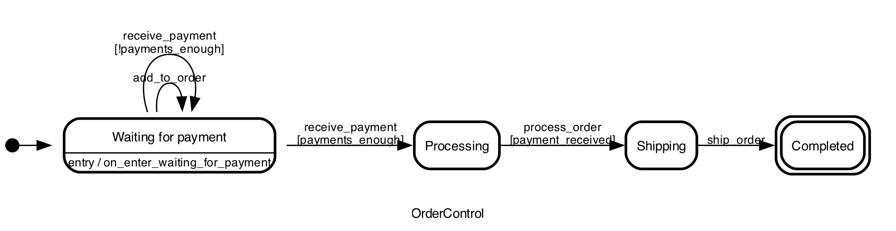

For higher resolution, set the DPI before exporting:

```py
>>> dot.set_dpi(300)

>>> dot.write_png("docs/images/order_control_machine_initial_300dpi.png")

```

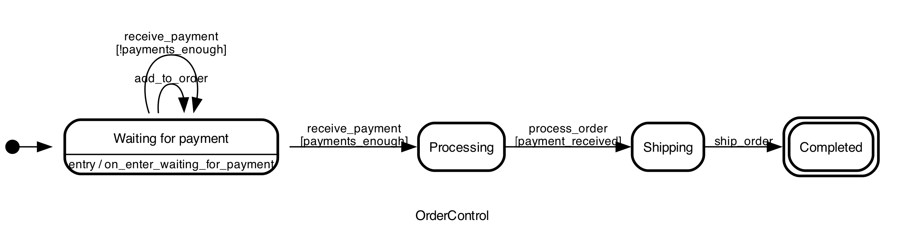

### Highlighting the current state

When you pass a machine **instance** (not a class), the diagram highlights
the current state:

``` py
>>> # This example will only run on automated tests if dot is present
>>> getfixture("requires_dot_installed")

>>> from statemachine.contrib.diagram import DotGraphMachine

>>> from tests.examples.order_control_machine import OrderControl

>>> machine = OrderControl()

>>> graph = DotGraphMachine(machine)  # also accepts instances

>>> machine.receive_payment(10)
[10]

>>> graph().write_png("docs/images/order_control_machine_processing.png")

```

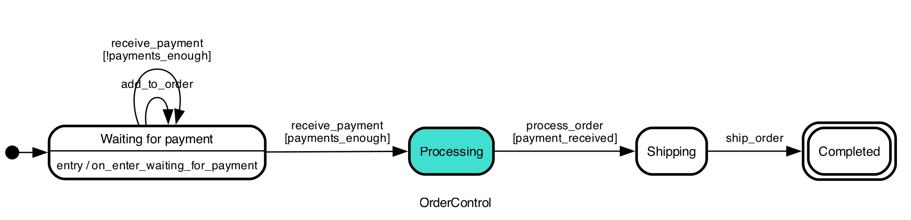

```{tip}
Every state machine instance exposes a `_graph()` shortcut that returns
the `pydot.Dot` object directly.
```

```py
>>> machine._graph()  # doctest: +ELLIPSIS
<pydot.core.Dot ...

```


## Command line

You can generate diagrams without writing Python code:

```bash
python -m statemachine.contrib.diagram <classpath> <output_file>
```

The output format is inferred from the file extension:

```bash
python -m statemachine.contrib.diagram tests.examples.traffic_light_machine.TrafficLightMachine diagram.png
```

```{note}
Supported formats include `dia`, `dot`, `fig`, `gif`, `jpg`, `pdf`,
`png`, `ps`, `svg`, and many others. See
[Graphviz output formats](https://graphviz.org/docs/outputs/) for the
complete list.
```


## Jupyter integration

State machine instances are automatically rendered as diagrams in
JupyterLab cells — no extra code needed:


## Visual showcase

This section demonstrates how each state machine feature is rendered in
diagrams. Each example shows both the **class** diagram (no active state) and
the **instance** diagram (with the current state highlighted).

``` py
>>> # This showcase will only run on automated tests if dot is present
>>> getfixture("requires_dot_installed")

>>> from statemachine import State, StateChart, HistoryState
>>> from statemachine.contrib.diagram import DotGraphMachine

```

### Simple states

A minimal state machine with three atomic states and linear transitions.

```py
>>> class SimpleSC(StateChart):
...     idle = State(initial=True)
...     running = State()
...     done = State(final=True)
...     start = idle.to(running)
...     finish = running.to(done)

>>> DotGraphMachine(SimpleSC)().write_png("docs/images/showcase_simple_class.png")

>>> sm = SimpleSC()
>>> DotGraphMachine(sm)().write_png("docs/images/showcase_simple_initial.png")

>>> sm.start()
>>> DotGraphMachine(sm)().write_png("docs/images/showcase_simple_running.png")

>>> sm.finish()
>>> DotGraphMachine(sm)().write_png("docs/images/showcase_simple_done.png")

```

| Class | Initial | Running | Done (final) |
|:---:|:---:|:---:|:---:|
| 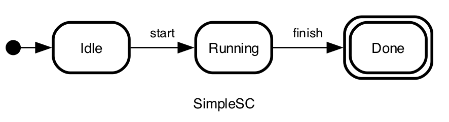 | 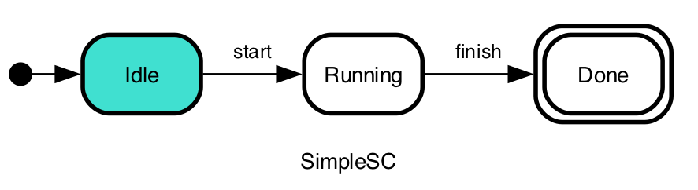 | 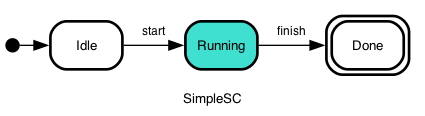 | 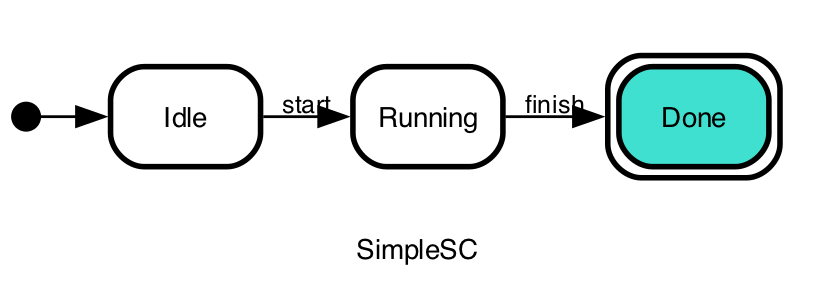 |


### Entry and exit actions

States can declare `entry` / `exit` callbacks, shown in the state label.

```py
>>> class ActionsSC(StateChart):
...     off = State(initial=True)
...     on = State()
...     done = State(final=True)
...     power_on = off.to(on)
...     shutdown = on.to(done)
...     def on_exit_off(self): ...
...     def on_enter_on(self): ...
...     def on_exit_on(self): ...
...     def on_enter_done(self): ...

>>> DotGraphMachine(ActionsSC)().write_png("docs/images/showcase_actions_class.png")

>>> sm = ActionsSC()
>>> sm.power_on()
>>> DotGraphMachine(sm)().write_png("docs/images/showcase_actions_on.png")

```

| Class | Active: On |
|:---:|:---:|
| 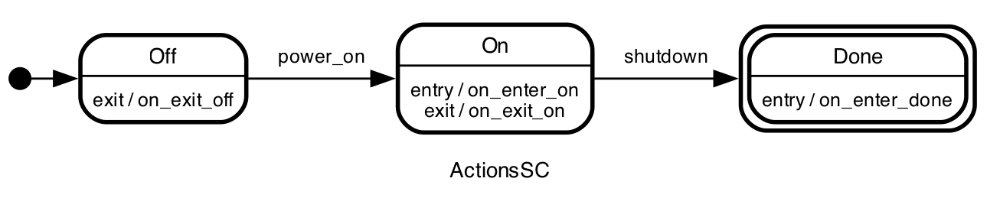 | 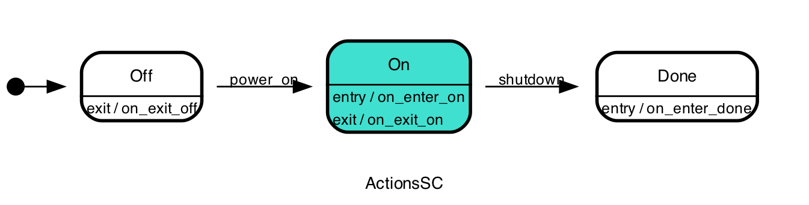 |


### Guard conditions

Transitions can have `cond` guards, shown in brackets on the edge label.

```py
>>> class GuardSC(StateChart):
...     pending = State(initial=True)
...     approved = State(final=True)
...     rejected = State(final=True)
...     def is_valid(self): return True
...     def is_invalid(self): return False
...     review = pending.to(approved, cond="is_valid") | pending.to(rejected, cond="is_invalid")

>>> DotGraphMachine(GuardSC)().write_png("docs/images/showcase_guards_class.png")

>>> sm = GuardSC()
>>> DotGraphMachine(sm)().write_png("docs/images/showcase_guards_pending.png")

```

| Class | Active: Pending |
|:---:|:---:|
| 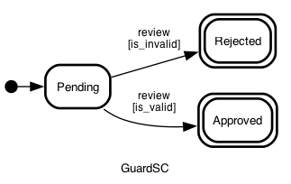 | 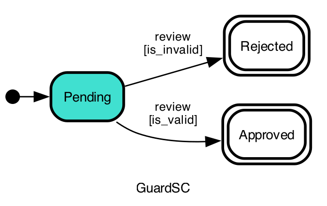 |


### Self-transitions

A transition from a state back to itself.

```py
>>> class SelfTransitionSC(StateChart):
...     counting = State(initial=True)
...     done = State(final=True)
...     increment = counting.to.itself()
...     stop = counting.to(done)

>>> DotGraphMachine(SelfTransitionSC)().write_png("docs/images/showcase_self_class.png")

>>> sm = SelfTransitionSC()
>>> DotGraphMachine(sm)().write_png("docs/images/showcase_self_active.png")

```

| Class | Active: Counting |
|:---:|:---:|
| 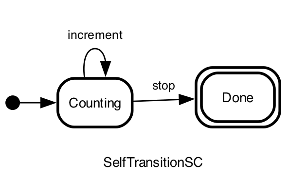 | 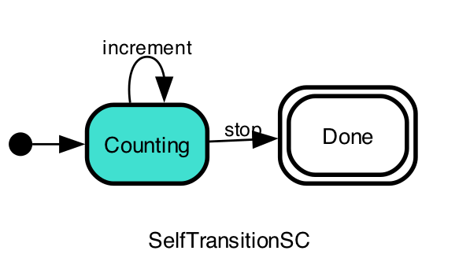 |


### Internal transitions

Internal transitions execute actions without exiting/entering the state.

```py
>>> class InternalSC(StateChart):
...     monitoring = State(initial=True)
...     done = State(final=True)
...     def log_status(self): ...
...     check = monitoring.to.itself(internal=True, on="log_status")
...     stop = monitoring.to(done)

>>> DotGraphMachine(InternalSC)().write_png("docs/images/showcase_internal_class.png")

>>> sm = InternalSC()
>>> DotGraphMachine(sm)().write_png("docs/images/showcase_internal_active.png")

```

| Class | Active: Monitoring |
|:---:|:---:|
| 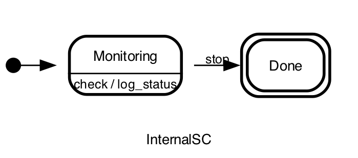 | 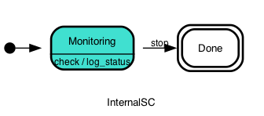 |


### Compound states

A compound state contains child states. Entering the compound activates
its initial child.

```py
>>> class CompoundSC(StateChart):
...     class active(State.Compound, name="Active"):
...         idle = State(initial=True)
...         working = State()
...         begin = idle.to(working)
...
...     off = State(initial=True)
...     done = State(final=True)
...     turn_on = off.to(active)
...     turn_off = active.to(done)

>>> DotGraphMachine(CompoundSC)().write_png("docs/images/showcase_compound_class.png")

>>> sm = CompoundSC()
>>> DotGraphMachine(sm)().write_png("docs/images/showcase_compound_off.png")

>>> sm.turn_on()
>>> DotGraphMachine(sm)().write_png("docs/images/showcase_compound_idle.png")

>>> sm.begin()
>>> DotGraphMachine(sm)().write_png("docs/images/showcase_compound_working.png")

```

| Class | Off | Active/Idle | Active/Working |
|:---:|:---:|:---:|:---:|
| 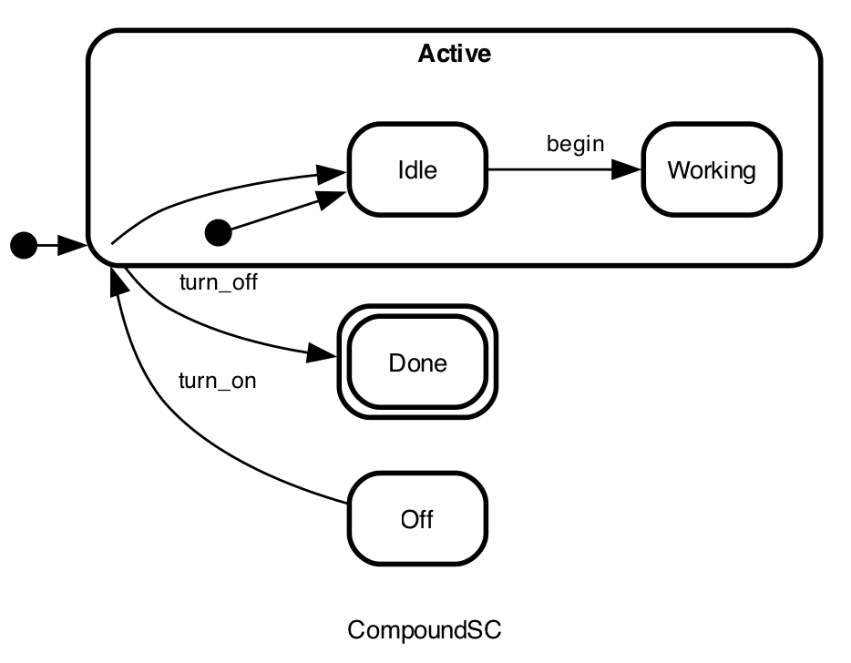 | 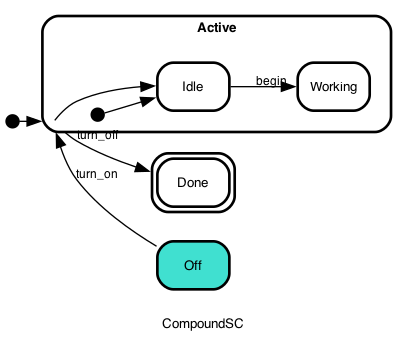 | 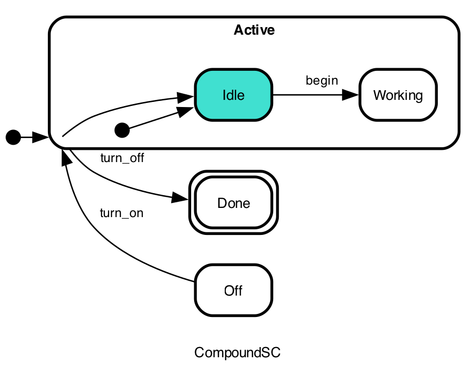 | 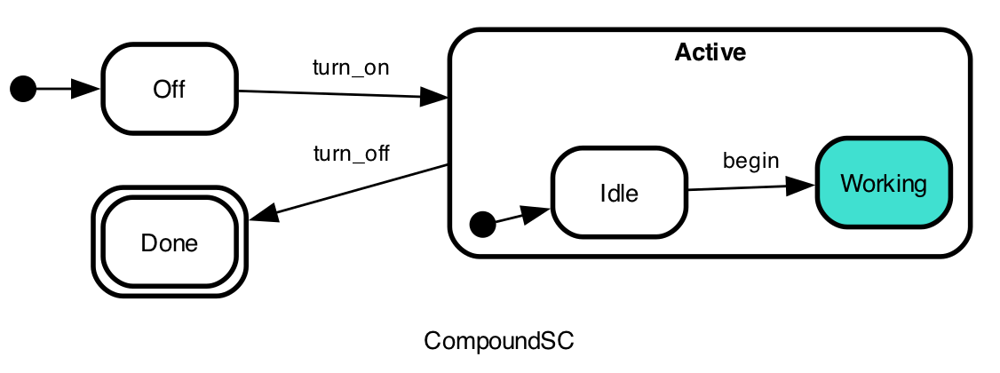 |


### Parallel states

A parallel state activates all its regions simultaneously.

```py
>>> class ParallelSC(StateChart):
...     class both(State.Parallel, name="Both"):
...         class left(State.Compound, name="Left"):
...             l1 = State(initial=True)
...             l2 = State(final=True)
...             go_l = l1.to(l2)
...         class right(State.Compound, name="Right"):
...             r1 = State(initial=True)
...             r2 = State(final=True)
...             go_r = r1.to(r2)
...
...     start = State(initial=True)
...     end = State(final=True)
...     enter = start.to(both)
...     done_state_both = both.to(end)

>>> DotGraphMachine(ParallelSC)().write_png("docs/images/showcase_parallel_class.png")

>>> sm = ParallelSC()
>>> sm.enter()
>>> DotGraphMachine(sm)().write_png("docs/images/showcase_parallel_active.png")

>>> sm.go_l()
>>> DotGraphMachine(sm)().write_png("docs/images/showcase_parallel_l_done.png")

```

| Class | Both active | Left done |
|:---:|:---:|:---:|
| 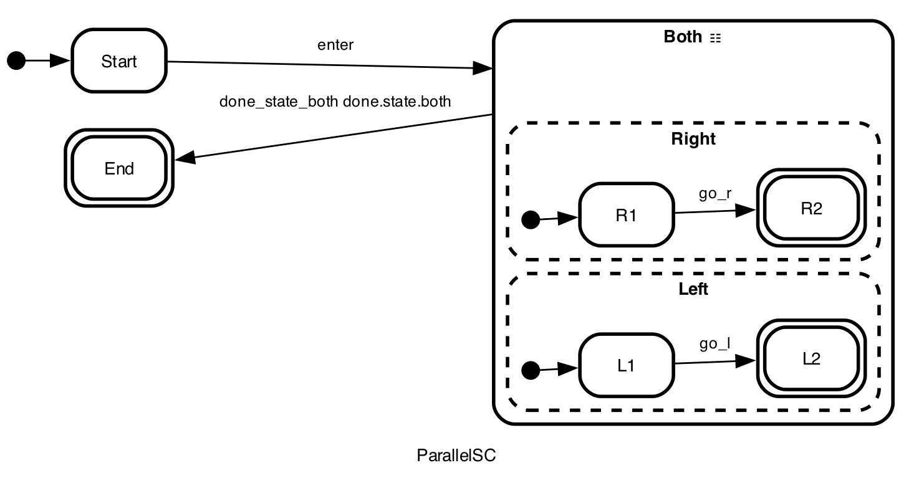 | 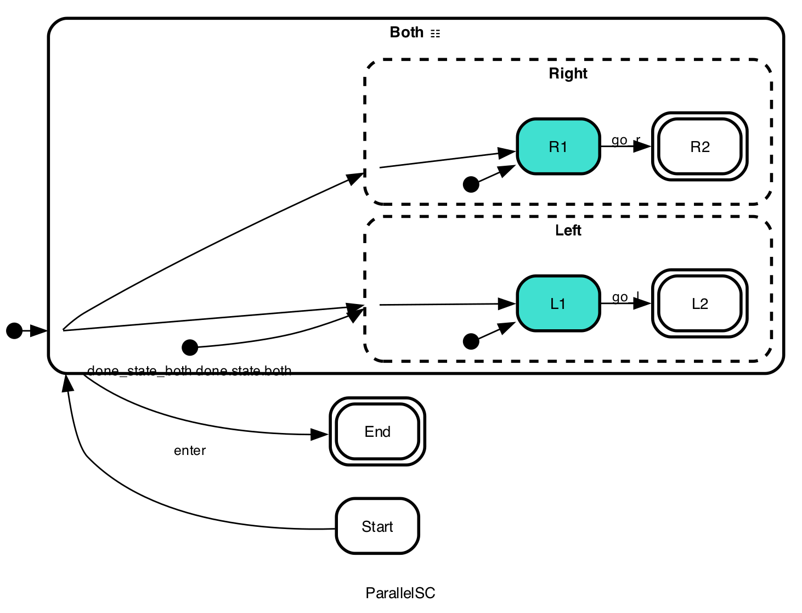 | 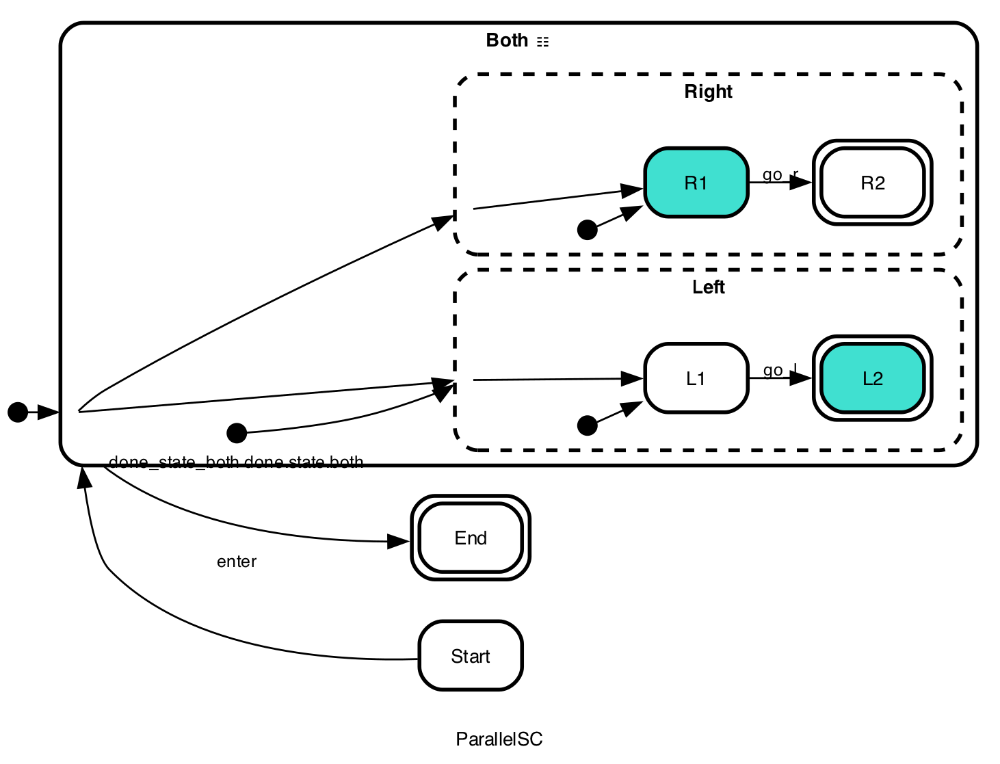 |


### History states (shallow)

A history pseudo-state remembers the last active child of a compound state.

```py
>>> class HistorySC(StateChart):
...     class process(State.Compound, name="Process"):
...         step1 = State(initial=True)
...         step2 = State()
...         advance = step1.to(step2)
...         h = HistoryState()
...
...     paused = State(initial=True)
...     pause = process.to(paused)
...     resume = paused.to(process.h)
...     begin = paused.to(process)

>>> DotGraphMachine(HistorySC)().write_png("docs/images/showcase_history_class.png")

>>> sm = HistorySC()
>>> sm.begin()
>>> sm.advance()
>>> DotGraphMachine(sm)().write_png("docs/images/showcase_history_step2.png")

>>> sm.pause()
>>> DotGraphMachine(sm)().write_png("docs/images/showcase_history_paused.png")

>>> sm.resume()
>>> DotGraphMachine(sm)().write_png("docs/images/showcase_history_resumed.png")

```

| Class | Step2 | Paused | Resumed (→Step2) |
|:---:|:---:|:---:|:---:|
| 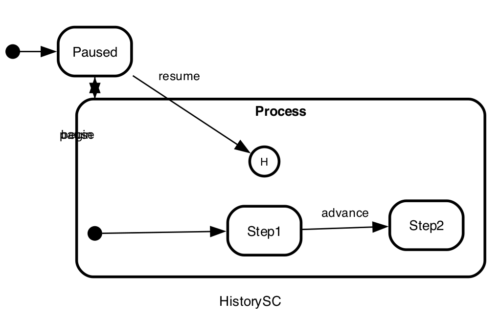 |  | 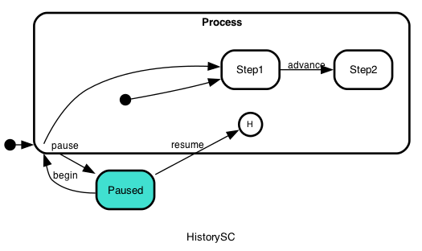 | 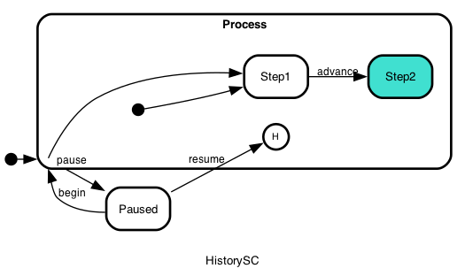 |


### Deep history

Deep history remembers the exact leaf state across nested compounds.

```py
>>> class DeepHistorySC(StateChart):
...     class outer(State.Compound, name="Outer"):
...         class inner(State.Compound, name="Inner"):
...             a = State(initial=True)
...             b = State()
...             go = a.to(b)
...         start = State(initial=True)
...         enter_inner = start.to(inner)
...         h = HistoryState(type="deep")
...
...     away = State(initial=True)
...     dive = away.to(outer)
...     leave = outer.to(away)
...     restore = away.to(outer.h)

>>> DotGraphMachine(DeepHistorySC)().write_png("docs/images/showcase_deep_history_class.png")

>>> sm = DeepHistorySC()
>>> sm.dive()
>>> sm.enter_inner()
>>> sm.go()
>>> DotGraphMachine(sm)().write_png("docs/images/showcase_deep_history_inner_b.png")

>>> sm.leave()
>>> sm.restore()
>>> DotGraphMachine(sm)().write_png("docs/images/showcase_deep_history_restored.png")

```

| Class | Inner/B | Restored (→Inner/B) |
|:---:|:---:|:---:|
| 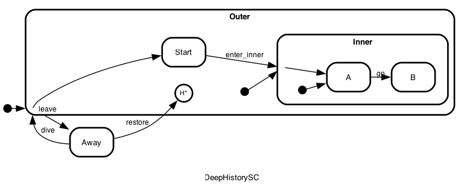 |  | 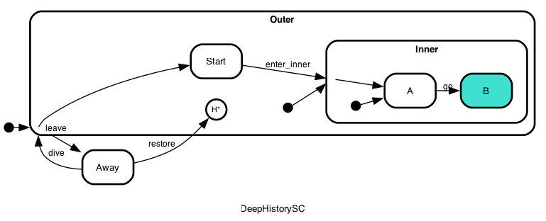 |


## Online generation (QuickChart)

If you prefer not to install Graphviz locally, you can generate diagrams
using the [QuickChart](https://quickchart.io/) online service:

```{eval-rst}
.. autofunction:: statemachine.contrib.diagram.quickchart_write_svg
```

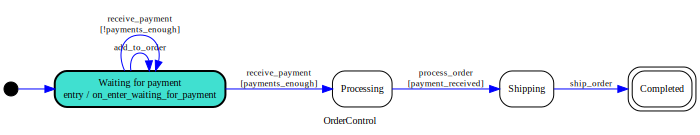
