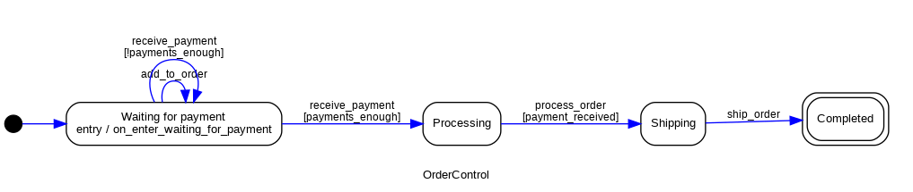

# Diagrams

You can generate diagrams from your statemachine.

```{note}
This functionality depends on [pydot](https://github.com/pydot/pydot), it means that you need to
have pydot installed on your system. pydot is a Python library that allows you to create and
manipulate graphs in [Graphviz](https://graphviz.org/)'s
[dot language](https://graphviz.org/doc/info/lang.html).

In order to use [pydot](https://github.com/pydot/pydot), we also need to have
[Graphviz](https://graphviz.org/) installed on your system.

You can install this library already with pydot dependency using the `extras` install option:

    pip install python-statemachine[diagrams]


Or to install `pydot` manually, you can use pip by running the following command:

    pip install pydot


To install Graphviz, you can visit the Graphviz website (https://graphviz.org/) and follow the
instructions for your operating system. Alternatively, you can use a package manager to install
Graphviz. For example, on Debian-based systems (such as Ubuntu), you can use the following command:

    apt-get install graphviz

```

### How to generate a diagram


```py
>>> from statemachine.contrib.diagram import DotGraphMachine

>>> from tests.examples.order_control_machine import OrderControl

>>> graph = DotGraphMachine(OrderControl)  # also accepts instances

>>> dot = graph()

>>> dot.to_string()  # doctest: +ELLIPSIS
'digraph list {...

```

With a `dot` graph instance, you can also generate images:

```py
>>> dot.write_png("docs/images/order_control_machine_initial.png")

```

As this one:





The current state is also highlighted:

``` py

>>> from statemachine.contrib.diagram import DotGraphMachine

>>> from tests.examples.order_control_machine import OrderControl

>>> machine = OrderControl()

>>> graph = DotGraphMachine(machine)  # also accepts instances

>>> machine.receive_payment(10)
[10]

>>> graph().write_png("docs/images/order_control_machine_processing.png")

```


## JupyterLab / Jupyter integration

Machines instances are automatically displayed as a diagram when used on JupyterLab cells:


