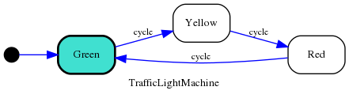
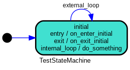

(transitions)=

```{testsetup}

>>> from statemachine import StateMachine, State

>>> from tests.examples.traffic_light_machine import TrafficLightMachine

```

# Transitions and events

A state machine is typically composed of a set of {ref}`state`, {ref}`transition`, {ref}`event`,
and {ref}`actions`. A state is a representation of the system's current condition or behavior.
A transition represents the change in the system's state in response to an event or condition.
An event is a trigger that causes the system to transition from one state to another, and action
is any side-effect, which is the way a StateMachine can cause things to happen in the
outside world.


Consider this traffic light machine as an example:




There're three transitions, one starting from green to yellow, another from
yellow to red, and another from red back to green. All these transitions
are triggered by the same {ref}`event` called `cycle`.

This state machine could be expressed in `python-statemachine` as:

```{literalinclude} ../tests/examples/traffic_light_machine.py
:language: python
:linenos:
:emphasize-lines: 12
:start-at: from statemachine
:end-before: "# %%"
```

In line 12, you can say that this code defines three transitions:

* `green.to(yellow)`
* `yellow.to(red)`
* `red.to(green)`

And these transitions are assigned to the {ref}`event` `cycle` defined at the class level.

```{note}

In fact, before the full class body is evaluated, the assigments of transitions are instances of [](statemachine.transition_list.TransitionList). When the state machine is evaluated by our custom [metaclass](https://docs.python.org/3/reference/datamodel.html#metaclasses), these names will be transformed into {ref}`Event` instances.

```

## Transitions

In an executing state machine, a {ref}`transition` is a transfer from one state to another. In a {ref}`statemachine`, a {ref}`transition` tells us what happens when an {ref}`event` occurs.


A transition can define {ref}`actions` that will be executed whenever that transition
is executed.

Transitions can have {ref}`conditions` allowing you to specify when a
transition may be executed.

An action associated with an event (before, on, after), will be assigned to all transitions
bounded that uses the event as trigger.


```{hint}
Usually you don't need to import and use a {ref}`transition` class directly in your code,
one of the most powerful features of this library is how transitions and events can be expressed
linking directly from/to {ref}`state` instances.
```

(self-transition)=

### Self transition

A transition that goes from a state to itself.

Syntax:

```py
>>> draft = State("Draft")

>>> draft.to.itself()
TransitionList([Transition(State('Draft', ...

```

### Internal transition

It's like a {ref}`self transition`.

But in contrast to a self-transition, no entry or exit actions are ever executed as a result of an internal transition.


Syntax:

```py
>>> draft = State("Draft")

>>> draft.to.itself(internal=True)
TransitionList([Transition(State('Draft', ...

```

Example:

```py
>>> class TestStateMachine(StateMachine):
...     initial = State(initial=True)
...
...     external_loop = initial.to.itself(on="do_something")
...     internal_loop = initial.to.itself(internal=True, on="do_something")
...
...     def __init__(self):
...         self.calls = []
...         super().__init__()
...
...     def do_something(self):
...         self.calls.append("do_something")
...
...     def on_exit_initial(self):
...         self.calls.append("on_exit_initial")
...
...     def on_enter_initial(self):
...         self.calls.append("on_enter_initial")

```
Usage:

```py
>>> # This example will only run on automated tests if dot is present
>>> getfixture("requires_dot_installed")

>>> sm = TestStateMachine()

>>> sm._graph().write_png("docs/images/test_state_machine_internal.png")

>>> sm.calls.clear()

>>> sm.external_loop()

>>> sm.calls
['on_exit_initial', 'do_something', 'on_enter_initial']

>>> sm.calls.clear()

>>> sm.internal_loop()

>>> sm.calls
['do_something']

```



```{note}

The internal transition is represented the same way as an entry/exit action, where
the event name is used to describe the transition.

```

## Events

An event is an external signal that something has happened.
They are sent to a state machine and allow the state machine to react.

An event starts a {ref}`transition`, which can be thought of as a "cause" that
initiates a change in the state of the system.

In `python-statemachine`, an event is specified as an attribute of the state machine class declaration or directly on the {ref}`event` parameter on a {ref}`transition`.


### Declaring events

The simplest way to declare an {ref}`event` is by assigning a transitions list to a name at the
State machine class level. The name will be converted to an {ref}`Event`:

```py
>>> from statemachine import Event

>>> class SimpleSM(StateMachine):
...     initial = State(initial=True)
...     final = State()
...
...     start = initial.to(final)  # start is a name that will be converted to an `Event`

>>> isinstance(SimpleSM.start, Event)
True
>>> sm = SimpleSM()
>>> sm.start()  # call `start` event

```

```{versionadded} 2.4.0
You can also explictly declare an {ref}`Event` instance, this helps IDEs to know that the event is callable, and also with translation strings.
```

To declare an explicit event you must also import the {ref}`Event`:

```py
>>> from statemachine import Event

>>> class SimpleSM(StateMachine):
...     initial = State(initial=True)
...     final = State()
...
...     start = Event(
...         initial.to(final),
...         name="Start the state machine"  # optional name, if not provided it will be derived from id
...     )

>>> SimpleSM.start.name
'Start the state machine'

>>> sm = SimpleSM()
>>> sm.start()  # call `start` event

```

An {ref}`Event` instance or an event id string can also be used as the `event` parameter of a {ref}`transition`. So you can mix these options as you need.

```py
>>> from statemachine import State, StateMachine, Event

>>> class TrafficLightMachine(StateMachine):
...     "A traffic light machine"
...
...     green = State(initial=True)
...     yellow = State()
...     red = State()
...
...     slowdown = Event(name="Slowing down")
...
...     cycle = Event(
...         green.to(yellow, event=slowdown)
...         | yellow.to(red, event=Event("stop", name="Please stop!"))
...         | red.to(green, event="go"),
...         name="Loop",
...     )
...
...     def on_transition(self, event_data, event: Event):
...         # The `event` parameter can be declared as `str` or `Event`, since `Event` is a subclass of `str`
...         # Note also that in this example, we're using `on_transition` instead of `on_cycle`, as this
...         # binds the action to run for every transition instead of a specific event ID.
...         assert event_data.event == event
...         return (
...             f"Running {event.name} from {event_data.transition.source.id} to "
...             f"{event_data.transition.target.id}"
...         )

>>> # Event IDs
>>> TrafficLightMachine.cycle.id
'cycle'
>>> TrafficLightMachine.slowdown.id
'slowdown'
>>> TrafficLightMachine.stop.id
'stop'
>>> TrafficLightMachine.go.id
'go'

>>> # Event names
>>> TrafficLightMachine.cycle.name
'Loop'
>>> TrafficLightMachine.slowdown.name
'Slowing down'
>>> TrafficLightMachine.stop.name
'Please stop!'
>>> TrafficLightMachine.go.name
'go'

>>> sm = TrafficLightMachine()

>>> sm.cycle()  # Your IDE is happy because it now knows that `cycle` is callable!
'Running Loop from green to yellow'

>>> sm.send("cycle")  # You can also use `send` in order to process dynamic event sources
'Running Loop from yellow to red'

>>> sm.send("cycle")
'Running Loop from red to green'

>>> sm.send("slowdown")
'Running Slowing down from green to yellow'

>>> sm.send("stop")
'Running Please stop! from yellow to red'

>>> sm.send("go")
'Running go from red to green'

```

```{tip}
Avoid mixing these options within the same project; instead, choose the one that best serves your use case. Declaring events as strings has been the standard approach since the library’s inception and can be considered syntactic sugar, as the state machine metaclass will convert all events to {ref}`Event` instances under the hood.

```

```{note}
In order to allow the seamless upgrade from using strings to `Event` instances, the {ref}`Event` inherits from `str`.

Note that this is just an implementation detail and can change in the future.

    >>> isinstance(TrafficLightMachine.cycle, str)
    True

```


```{warning}

An {ref}`Event` declared as string will have its `name` set equal to its `id`. This is for backward compatibility when migrating from previous versions.

In the next major release, `Event.name` will default to a capitalized version of `id` (i.e., `Event.id.replace("_", " ").capitalize()`).

Starting from version 2.4.0, use `Event.id` to check for event identifiers instead of `Event.name`.

```


### Triggering events

Triggering an event on a state machine means invoking or sending a signal, initiating the
process that may result in executing a transition.

This process usually involves

1. checking the current state
1. evaluating any guard conditions
associated with the transition
1. executing any actions associated with the transition and (current and target) states
1. finally updating the current state.

```{seealso}
See {ref}`actions` and {ref}`validators and guards`.
```

You can invoke the event in an imperative syntax:

```py
>>> machine = TrafficLightMachine()

>>> machine.cycle()
'Running Loop from green to yellow'

>>> machine.current_state.id
'yellow'

```

Or in an event-oriented style, events are `send`:

```py
>>> machine.send("cycle")
'Running Loop from yellow to red'

>>> machine.current_state.id
'red'

```

This action is executed before the transition associated with `cycle` event is activated.
You can raise an exception at this point to stop a transition from completing.

```py
>>> machine.current_state.id
'red'

>>> machine.cycle()
'Running Loop from red to green'

>>> machine.current_state.id
'green'

```
