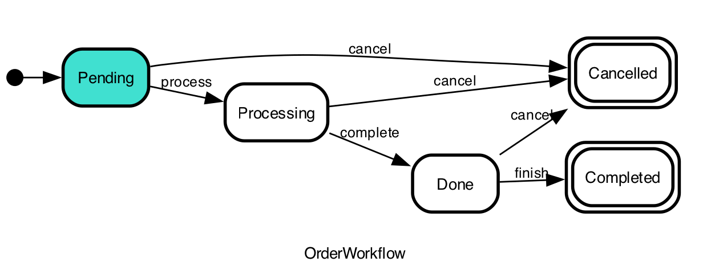
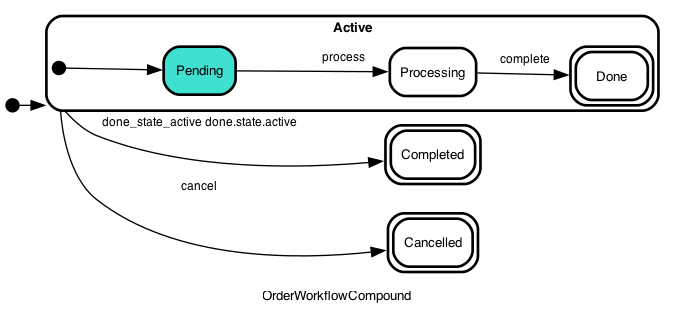

(transitions)=
(transition)=

# Transitions

```{seealso}
New to statecharts? See [](concepts.md) for an overview of how states,
transitions, events, and actions fit together.
```

A transition describes a valid state change: it connects a **source** state to
a **target** state and is triggered by an {ref}`event <events>`. Transitions
can carry {ref}`actions` (side-effects) and {ref}`conditions <validators and guards>`
that control whether the transition fires.


## Declaring transitions

Link states using `source.to(target)` and assign the result to a class
attribute — the attribute name becomes the event:

```py
>>> from statemachine import State, StateChart

>>> class OrderSM(StateChart):
...     pending = State(initial=True)
...     confirmed = State(final=True)
...
...     confirm = pending.to(confirmed)

>>> sm = OrderSM()
>>> sm.send("confirm")
>>> "confirmed" in sm.configuration_values
True

```


### Transition parameters

| Parameter | Description |
|---|---|
| `on` | Action callback(s) to run during the transition. See {ref}`transition-actions`. |
| `before` | Callback(s) to run before exit/on/enter. |
| `after` | Callback(s) to run after the transition completes. |
| `cond` | Guard condition(s). See {ref}`validators and guards`. |
| `unless` | Negative guard — transition fires when this returns `False`. |
| `validators` | Validation callback(s) that raise on failure. |
| `event` | Override the event for this transition. See {ref}`event-parameter`. |
| `internal` | If `True`, no exit/enter actions fire. See {ref}`internal transition`. |


### Combining transitions with `|`

The `|` operator merges transitions under a single event. Each transition
is evaluated in declaration order — the first whose conditions are met wins:

```py
>>> class TrafficLight(StateChart):
...     green = State(initial=True)
...     yellow = State()
...     red = State()
...
...     cycle = green.to(yellow) | yellow.to(red) | red.to(green)

>>> sm = TrafficLight()
>>> sm.send("cycle")
>>> "yellow" in sm.configuration_values
True

```

Combine `|` with guards to route the same event to different targets:

```py
>>> class OrderReview(StateChart):
...     pending = State(initial=True)
...     approved = State(final=True)
...     rejected = State(final=True)
...
...     review = (
...         pending.to(approved, cond="is_valid")
...         | pending.to(rejected)
...     )
...
...     def is_valid(self, score: int = 0):
...         return score >= 70

>>> sm = OrderReview()
>>> sm.send("review", score=50)
>>> "rejected" in sm.configuration_values
True

>>> sm = OrderReview()
>>> sm.send("review", score=85)
>>> "approved" in sm.configuration_values
True

```

The first transition whose guard passes wins. When `score < 70`, `is_valid`
returns `False`, so the second transition (no guard — always matches) fires.


### `from_()` and `from_.any()`

`target.from_(source)` declares the same transition from the target's
perspective — useful when multiple sources converge on one target:

```py
>>> class OrderSM(StateChart):
...     pending = State(initial=True)
...     processing = State()
...     shipped = State(final=True)
...
...     process = pending.to(processing)
...     ship = shipped.from_(pending, processing)

```

`target.from_.any()` creates a transition from **every non-final state** —
useful for global events like "cancel" that should be reachable from anywhere:

```py
>>> class OrderWorkflow(StateChart):
...     pending = State(initial=True)
...     processing = State()
...     done = State()
...     completed = State(final=True)
...     cancelled = State(final=True)
...
...     process = pending.to(processing)
...     complete = processing.to(done)
...     finish = done.to(completed)
...     cancel = cancelled.from_.any()

>>> sm = OrderWorkflow()
>>> sm.send("cancel")
>>> "cancelled" in sm.configuration_values
True

```

With {ref}`compound states <compound-states>`, there is another way to model
the same workflow: group the cancellable states under a compound parent, and
define a single transition out of it. The `cancel` event exits the compound
regardless of which child is active:

```py
>>> class OrderWorkflowCompound(StateChart):
...     class active(State.Compound):
...         pending = State(initial=True)
...         processing = State()
...         done = State(final=True)
...
...         process = pending.to(processing)
...         complete = processing.to(done)
...     completed = State(final=True)
...     cancelled = State(final=True)
...     done_state_active = active.to(completed)
...     cancel = active.to(cancelled)

>>> sm = OrderWorkflowCompound()
>>> sm.send("process")
>>> sm.send("cancel")
>>> "cancelled" in sm.configuration_values
True

```

Compare the diagrams — both model the same behavior, but the compound version
makes the "cancellable" grouping explicit in the hierarchy:

```py
>>> getfixture("requires_dot_installed")
>>> OrderWorkflow()._graph().write_png("docs/images/transition_from_any.png")
>>> OrderWorkflowCompound()._graph().write_png("docs/images/transition_compound_cancel.png")

```

| `from_.any()` | Compound |
|---|---|
|  |  |

The compound approach scales better as you add more states — no need to
remember to include each new state in a `from_()` list.


(self-transition)=
(self transition)=

## Self-transitions and internal transitions

A **self-transition** goes from a state back to itself. It exits and
re-enters the state, running all exit and entry actions:

```py
>>> class RetryOrder(StateChart):
...     processing = State(initial=True)
...     done = State(final=True)
...
...     retry = processing.to.itself(on="do_retry")
...     finish = processing.to(done)
...
...     attempts: int = 0
...
...     def do_retry(self):
...         self.attempts += 1

>>> sm = RetryOrder()
>>> sm.send("retry")
>>> sm.send("retry")
>>> sm.attempts
2

```

(internal transition)=
(internal-transition)=

An **internal transition** stays in the same state **without** running exit
or entry actions — only the `on` callback executes. Use `internal=True`:

```py
>>> class OrderCart(StateChart):
...     shopping = State(initial=True)
...     checkout = State(final=True)
...
...     add_item = shopping.to.itself(internal=True, on="do_add_item")
...     pay = shopping.to(checkout)
...
...     total: float = 0
...
...     def do_add_item(self, price: float = 0):
...         self.total += price

>>> sm = OrderCart()
>>> sm.send("add_item", price=9.99)
>>> sm.send("add_item", price=4.50)
>>> sm.total
14.49

```

The key difference: self-transitions fire exit/enter callbacks (useful when
entering a state has side-effects like resetting a timer), while internal
transitions skip them (useful for pure data updates that shouldn't re-trigger
entry logic).

```{seealso}
The `enable_self_transition_entries` flag in {ref}`behaviour` controls whether
self-transitions run exit/enter actions. `StateChart` defaults to `True` (SCXML
semantics); `StateMachine` defaults to `False` (legacy behavior).
```


(eventless)=

## Eventless (automatic) transitions

```{versionadded} 3.0.0
```

Eventless transitions have no event trigger — they fire automatically when
their guard condition evaluates to `True`. If no guard is specified, they
fire immediately (unconditional). Declare them as bare statements, without
assigning to a variable:

```py
>>> from statemachine import State, StateChart

>>> class AutoEscalation(StateChart):
...     normal = State(initial=True)
...     escalated = State(final=True)
...     normal.to(escalated, cond="should_escalate")
...     report = normal.to.itself(internal=True, on="add_report")
...     report_count = 0
...     def should_escalate(self):
...         return self.report_count >= 3
...     def add_report(self):
...         self.report_count += 1

>>> sm = AutoEscalation()
>>> sm.send("report")
>>> sm.send("report")
>>> "normal" in sm.configuration_values
True

>>> sm.send("report")
>>> "escalated" in sm.configuration_values
True

```

The eventless transition fires automatically after the third report pushes
`report_count` past the threshold.

```{seealso}
See {ref}`continuous-machines` for chains, compound interactions, and `In()`
guards.
```

(cross-boundary-transitions)=

## Cross-boundary transitions

```{versionadded} 3.0.0
```

In statecharts, transitions can cross compound state boundaries — going from a
state inside one compound to a state outside, or into a different compound. The
engine automatically determines which states to exit and enter by computing the
**transition domain**: the smallest compound ancestor that contains both the
source and all target states.

```py
>>> from statemachine import State, StateChart

>>> class OrderFulfillment(StateChart):
...     class picking(State.Compound):
...         locating = State(initial=True)
...         packing = State()
...         locate = locating.to(packing)
...     class shipping(State.Compound):
...         labeling = State(initial=True)
...         dispatched = State(final=True)
...         dispatch = labeling.to(dispatched)
...     ship = picking.to(shipping)

>>> sm = OrderFulfillment()
>>> set(sm.configuration_values) == {"picking", "locating"}
True

>>> sm.send("ship")
>>> set(sm.configuration_values) == {"shipping", "labeling"}
True

```

When `ship` fires, the engine:
1. Computes the transition domain (the root, since `picking` and `shipping` are
   siblings)
2. Exits `locating` and `picking` (running their exit actions)
3. Enters `shipping` and its initial child `labeling` (running their entry
   actions)


(transition-priority)=

## Transition priority in compound states

```{versionadded} 3.0.0
```

When an event could match transitions at multiple levels of the state hierarchy,
transitions from **descendant states take priority** over transitions from
ancestor states. This follows the SCXML specification: the most specific
(deepest) matching transition wins.

```py
>>> from statemachine import State, StateChart

>>> class OrderProcessing(StateChart):
...     log = []
...     class fulfillment(State.Compound):
...         class picking(State.Compound):
...             s1 = State(initial=True)
...             s2 = State(final=True)
...             go = s1.to(s2, on="log_picking")
...         assert isinstance(picking, State)
...         packed = State(final=True)
...         done_state_picking = picking.to(packed)
...     shipped = State(final=True)
...     done_state_fulfillment = fulfillment.to(shipped)
...     def log_picking(self):
...         self.log.append("picking handled it")

>>> sm = OrderProcessing()
>>> sm.send("go")
>>> sm.log
['picking handled it']

```

If two transitions at the same level would exit overlapping states (a conflict),
the one declared first wins.
