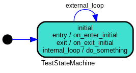

(transitions)=
(transition)=

```{testsetup}

>>> from statemachine import StateChart, State

```

# Transitions

```{seealso}
New to statecharts? See [](concepts.md) for an overview of how states,
transitions, events, and actions fit together.
```

A transition describes a valid state change: it connects a **source** state to
a **target** state and is triggered by an {ref}`event <events>`. Transitions
can carry {ref}`actions` (side-effects) and {ref}`conditions <validators and guards>` that
control whether the transition fires.


## Declaring transitions

The most common way to declare a transition is to link states directly using
the `source.to(target)` syntax and assign the result to a class attribute —
the attribute name becomes the event that triggers the transition:

```py
>>> class SimpleSM(StateChart):
...     draft = State(initial=True)
...     published = State(final=True)
...
...     publish = draft.to(published)

>>> sm = SimpleSM()
>>> sm.send("publish")
>>> "published" in sm.configuration_values
True

```


### `target.from_(source)`

You can also declare the transition from the target's perspective:

```py
>>> class SimpleSM(StateChart):
...     draft = State(initial=True)
...     review = State()
...     published = State(final=True)
...
...     submit = review.from_(draft)
...     publish = published.from_(review)

>>> sm = SimpleSM()
>>> sm.send("submit")
>>> sm.send("publish")
>>> "published" in sm.configuration_values
True

```


### Multiple sources or targets

Both `.to()` and `.from_()` accept multiple states. Each pair creates a
separate transition under the same event — the first transition whose
conditions are met wins:

```py
>>> class Router(StateChart):
...     start = State(initial=True)
...     a = State(final=True)
...     b = State(final=True)
...
...     route = start.to(a, cond="go_a") | start.to(b, cond="go_b")
...
...     def __init__(self, choice="a"):
...         self.choice = choice
...         super().__init__()
...     def go_a(self):
...         return self.choice == "a"
...     def go_b(self):
...         return self.choice == "b"

>>> sm = Router(choice="b")
>>> sm.send("route")
>>> "b" in sm.configuration_values
True

```

Multiple sources with `.from_()`:

```py
>>> class Merge(StateChart):
...     a = State(initial=True)
...     b = State()
...     done = State(final=True)
...
...     go = a.to(b)
...     finish = done.from_(a, b)

```


### `target.from_.any()`

Creates a transition from **every non-final state** to the target — useful for
global events like "cancel" that should be reachable from anywhere:

```py
>>> class OrderWorkflow(StateChart):
...     pending = State(initial=True)
...     processing = State()
...     completed = State(final=True)
...     cancelled = State(final=True)
...
...     process = pending.to(processing)
...     complete = processing.to(completed)
...     cancel = cancelled.from_.any()

>>> sm = OrderWorkflow()
>>> sm.send("cancel")
>>> "cancelled" in sm.configuration_values
True

```


### Combining transitions with `|`

The `|` operator merges transition lists under a single event:

```py
>>> class TrafficLight(StateChart):
...     green = State(initial=True)
...     yellow = State()
...     red = State()
...
...     cycle = green.to(yellow) | yellow.to(red) | red.to(green)

>>> sm = TrafficLight()
>>> sm.send("cycle")
>>> "yellow" in sm.configuration_values
True

```


### Transition parameters

| Parameter | Description |
|---|---|
| `on` | Action callback(s) to run during the transition. See {ref}`transition-actions`. |
| `before` | Callback(s) to run before exit/on/enter. |
| `after` | Callback(s) to run after the transition completes. |
| `cond` | Guard condition(s). See {ref}`validators and guards`. |
| `unless` | Negative guard — transition fires when this returns `False`. |
| `validators` | Validation callback(s) that raise on failure. |
| `event` | Override the event that triggers this transition. See {ref}`declaring-events`. |
| `internal` | If `True`, no exit/enter actions fire. See {ref}`internal transition`. |


(self-transition)=
(self transition)=

## Self transition

A transition that goes from a state to itself.

Syntax:

```py
>>> draft = State("Draft")

>>> draft.to.itself()
TransitionList([Transition('Draft', 'Draft', event=[], internal=False, initial=False)])

```

(internal transition)=
(internal-transition)=

## Internal transition

It's like a {ref}`self transition`.

But in contrast to a self-transition, no entry or exit actions are ever executed as a result of an internal transition.


Syntax:

```py
>>> draft = State("Draft")

>>> draft.to.itself(internal=True)
TransitionList([Transition('Draft', 'Draft', event=[], internal=True, initial=False)])

```

Example:

```py
>>> class TestStateMachine(StateChart):
...     enable_self_transition_entries = False
...     initial = State(initial=True)
...
...     external_loop = initial.to.itself(on="do_something")
...     internal_loop = initial.to.itself(internal=True, on="do_something")
...
...     def __init__(self):
...         self.calls = []
...         super().__init__()
...
...     def do_something(self):
...         self.calls.append("do_something")
...
...     def on_exit_initial(self):
...         self.calls.append("on_exit_initial")
...
...     def on_enter_initial(self):
...         self.calls.append("on_enter_initial")

```
Usage:

```py
>>> # This example will only run on automated tests if dot is present
>>> getfixture("requires_dot_installed")

>>> sm = TestStateMachine()

>>> sm._graph().write_png("docs/images/test_state_machine_internal.png")

>>> sm.calls.clear()

>>> sm.external_loop()

>>> sm.calls
['on_exit_initial', 'do_something', 'on_enter_initial']

>>> sm.calls.clear()

>>> sm.internal_loop()

>>> sm.calls
['do_something']

```



```{note}

The internal transition is represented the same way as an entry/exit action, where
the event name is used to describe the transition.

```

(eventless)=

## Eventless (automatic) transitions

```{versionadded} 3.0.0
```

Eventless transitions have no event trigger — they fire automatically when their guard
condition evaluates to `True`. If no guard is specified, they fire immediately
(unconditional). This is useful for modeling automatic state progressions.

```py
>>> from statemachine import State, StateChart

>>> class RingCorruption(StateChart):
...     resisting = State(initial=True)
...     corrupted = State(final=True)
...     resisting.to(corrupted, cond="is_corrupted")
...     bear_ring = resisting.to.itself(internal=True, on="increase_power")
...     ring_power = 0
...     def is_corrupted(self):
...         return self.ring_power > 5
...     def increase_power(self):
...         self.ring_power += 2

>>> sm = RingCorruption()
>>> sm.send("bear_ring")
>>> sm.send("bear_ring")
>>> "resisting" in sm.configuration_values
True

>>> sm.send("bear_ring")
>>> "corrupted" in sm.configuration_values
True

```

The eventless transition from `resisting` to `corrupted` fires automatically after
the third `bear_ring` event pushes `ring_power` past the threshold.

```{seealso}
See {ref}`continuous-machines` for chains, compound interactions, and `In()` guards.
```

(cross-boundary-transitions)=

## Cross-boundary transitions

```{versionadded} 3.0.0
```

In statecharts, transitions can cross compound state boundaries — going from a
state inside one compound to a state outside, or into a different compound. The
engine automatically determines which states to exit and enter by computing the
**transition domain**: the smallest compound ancestor that contains both the
source and all target states.

```py
>>> from statemachine import State, StateChart

>>> class MiddleEarthJourney(StateChart):
...     class rivendell(State.Compound):
...         council = State(initial=True)
...         preparing = State()
...         get_ready = council.to(preparing)
...     class moria(State.Compound):
...         gates = State(initial=True)
...         bridge = State(final=True)
...         cross = gates.to(bridge)
...     march = rivendell.to(moria)

>>> sm = MiddleEarthJourney()
>>> set(sm.configuration_values) == {"rivendell", "council"}
True

>>> sm.send("march")
>>> set(sm.configuration_values) == {"moria", "gates"}
True

```

When `march` fires, the engine:
1. Computes the transition domain (the root, since `rivendell` and `moria` are siblings)
2. Exits `council` and `rivendell` (running their exit actions)
3. Enters `moria` and its initial child `gates` (running their entry actions)

A transition can also go from a deeply nested child to an outer state:

```py
>>> from statemachine import State, StateChart

>>> class MoriaEscape(StateChart):
...     class moria(State.Compound):
...         class halls(State.Compound):
...             entrance = State(initial=True)
...             bridge = State(final=True)
...             cross = entrance.to(bridge)
...         assert isinstance(halls, State)
...         depths = State(final=True)
...         descend = halls.to(depths)
...     daylight = State(final=True)
...     escape = moria.to(daylight)

>>> sm = MoriaEscape()
>>> set(sm.configuration_values) == {"moria", "halls", "entrance"}
True

>>> sm.send("escape")
>>> set(sm.configuration_values) == {"daylight"}
True

```

(transition-priority)=

## Transition priority in compound states

```{versionadded} 3.0.0
```

When an event could match transitions at multiple levels of the state hierarchy,
transitions from **descendant states take priority** over transitions from
ancestor states. This follows the SCXML specification: the most specific
(deepest) matching transition wins.

```py
>>> from statemachine import State, StateChart

>>> class PriorityExample(StateChart):
...     log = []
...     class outer(State.Compound):
...         class inner(State.Compound):
...             s1 = State(initial=True)
...             s2 = State(final=True)
...             go = s1.to(s2, on="log_inner")
...         assert isinstance(inner, State)
...         after_inner = State(final=True)
...         done_state_inner = inner.to(after_inner)
...     after_outer = State(final=True)
...     done_state_outer = outer.to(after_outer)
...     def log_inner(self):
...         self.log.append("inner won")

>>> sm = PriorityExample()
>>> sm.send("go")
>>> sm.log
['inner won']

```

If two transitions at the same level would exit overlapping states (a conflict),
the one selected first in document order wins.
